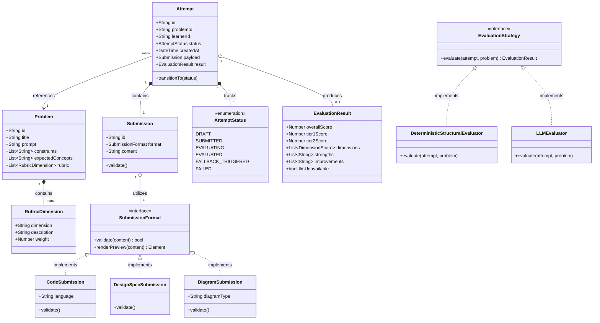

# DESIGN_NOTE.md — Architecture, Domain Model & Design Decisions

**CipherSchools Hiring Assignment — SEP'2026**  
**Author:** Bharat Dhuva · bharatdhuva27@gmail.com  
**Deliverables #2, #3, & #4 (40% Total Evaluation Weight)**

---

## 1. MVP Overview & User Flow

The LLD Practice Platform provides an end-to-end interactive practice loop designed specifically for software engineers practicing Low-Level Design:

```
[1. Choose Problem] ────> [2. Think / Design] ────> [3. Submit Solution]
         ^                                                 │
         │                                                 ▼
[6. Refine & Try Again] <── [5. Review History] <── [4. Get Explainable Feedback]
```

1. **Choose Problem**: Select from 3 seeded classic problems (`Parking Lot`, `Elevator Dispatcher`, `Vending Machine`) with explicit requirements, constraints, and rubrics.
2. **Think / Design**: Work in the workspace using starter templates for Code, Design Spec, or Mermaid Diagram notation.
3. **Submit Solution**: Asynchronous submission creating a typed `Attempt` aggregate.
4. **Get Explainable Feedback**: Two-tier evaluation separating fast deterministic structural audits (<50ms) from rubric-grounded AI reasoning feedback.
5. **Review History**: Inspect historical score evolution, dimension breakdowns, and feedback across attempts.
6. **Try Again**: 1-click re-attempt with previous design state pre-loaded to iterate and verify improvements.

---

## 2. Domain Model & Class Diagram

### Core Entities & Relationships



---

## 3. Two-Tier Evaluation Architecture

### Tier 1: Deterministic Structural Evaluator (`backend/src/evaluation/DeterministicEvaluator.ts`)
- **Latency**: < 50ms. Runs synchronously inside the worker.
- **Checks Performed**:
  - Class and interface counts.
  - Verification of required design patterns (e.g. `Strategy Pattern`, `State Pattern`).
  - Encapsulation audit (detection of public mutable variables vs getters/setters).
  - Anti-pattern detection (God Classes with > 10 methods/responsibilities).
  - Thread-safety indicators (presence of synchronized locks, atomic references, or mutexes).

### Tier 2: Anchored Rubric Reasoning Engine (`backend/src/evaluation/LLMEvaluator.ts`)
- **Latency**: 3–8 seconds.
- **Mechanism**:
  - Injects the problem's explicit `rubric[]` and `expectedConcepts[]` into structured OpenAI `gpt-4o-mini` prompt with `response_format: { type: 'json_object' }`.
  - Evaluates trade-offs, interface abstractions, and Single Responsibility Principle adherence.
  - Emits scores for each dimension weighted according to the problem rubric.
- **Graceful Timeout & Fallback (Design Question #5)**:
  - If the LLM call times out or encounters network/credential issues, the worker transitions the attempt to `FALLBACK_TRIGGERED`.
  - The UI immediately renders Tier-1 deterministic findings with an amber banner: *"AI Reasoning unavailable — showing deterministic structural evaluation"*, offering a 1-click retry.

---

## 4. Answers to the 5 Core Design Questions (Section 4 of Assignment)

### Q1: What does a learner actually need to provide for an LLD practice attempt to be meaningful?
A learner does not need to write 1,000 lines of boilerplate or database queries. A meaningful LLD submission requires 3 core elements:
1. **Core Domain Entities & Responsibilities**: Explicit class definitions indicating what each entity owns and does not own (SRP).
2. **Abstractions & Interfaces**: Interface seams separating high-level orchestration from low-level algorithms (e.g. `ParkingStrategy`, `PricingModel`, `SchedulingAlgorithm`).
3. **State Transitions & Invariants**: Enums, state patterns, or lock granularity showing how invalid states (e.g. overfilling slots, split-brain elevator directions) are prevented.

### Q2: What makes feedback useful when there can be more than one valid LLD solution?
Useful feedback never compares code against an arbitrary reference solution. Instead, it is **rubric-anchored and trade-off focused**:
- It evaluates the design against fundamental engineering principles: *coupling, cohesion, extensibility, and concurrency safety*.
- It explains the **consequences** of architectural choices (e.g., *"Using a coarse-grained synchronized lock on ParkingLot guarantees thread safety but bottlenecks slot assignment throughput under peak concurrent ingress"*).

### Q3: Which parts of evaluation should be deterministic, and which parts benefit from an LLM?
- **Deterministic**: Syntax verification, class count, encapsulation checks, pattern detection (Strategy/State presence), and God-Class detection. Deterministic checks are fast (<50ms), reliable, and cheap.
- **LLM Reasoning**: Evaluating whether abstractions are placed at the right boundaries, whether responsibilities are conflated, and whether trade-offs are well-justified given the constraints.

### Q4: How would your design accommodate another evaluation approach or another submission format later?
Through the **Strategy Pattern** and **SubmissionFormat Abstraction**:
- **New Submission Format**: Implement `SubmissionFormat.validate()` and `render()` (e.g. `ExcalidrawSubmission`). Registered in `SubmissionFormatFactory` — requires zero modifications to existing domain entities or routes (OCP).
- **New Evaluator**: Implement `EvaluationStrategy.evaluate()` (e.g. SonarQube linter or unit test runner). Registered in `EvaluatorRegistry` — requires zero changes to `EvaluationWorker`.

### Q5: What should happen if evaluation takes time or fails?
- **First-Class State Transitions**: `AttemptStatus` models `EVALUATING`, `FALLBACK_TRIGGERED`, and `FAILED` as explicit lifecycle states rather than unhandled promise rejections.
- **Deterministic Fallback**: If the LLM times out (>10s) or fails, the platform presents the Tier-1 structural audit immediately with a clear alert and a "Retry AI Evaluation" button. The learner is never left hanging on a frozen spinner.

---

## 5. Key Engineering Trade-offs Log

| Area | Decision Made | Alternative Rejected | Rationale |
|---|---|---|---|
| **Identity / Auth** | UUID in `localStorage` | Email + JWT Session | Guardrails explicitly warn against spending time on auth infra. UUID provides instant learner tracking without signup friction. |
| **Worker Queue** | Mongo-based polling worker | Redis + BullMQ | Self-contained monolith with zero external Redis dependency; zero Docker setup friction. |
| **Diagrams** | Mermaid text notation | Excalidraw iframe | Fully proves the `SubmissionFormat` abstraction seam without complex CORS and iframe state synchronizations. |
| **Attempt State** | Pure transition functions | In-place entity mutation | Pure functions are trivially unit-testable (no DB mocks needed) and guarantee immutable state flow. |
